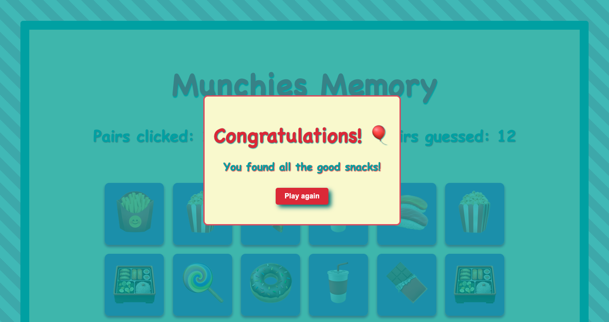

# Munchies Memory

Welcome to **Munchies Memory**, a delightful twist on the classic memory game! This version features delicious sweets and snacks on the cards to add a little extra sweetness to your gameplay and your day. 🍬🍭🍫

## Game Features

- **12 Card Pairs:** Match all 12 pairs to win the game.
- **Reset Button:** Restart the game at any time using the reset button.
- **Winning Message:** Receive a congratulatory message when you find all the pairs.

## How to Play

1. Click on any two cards to flip them over.
2. If the cards match, they remain visible. If not, they turn back over.
3. Keep flipping cards to find all the matching pairs.
4. Use the reset button to restart the game at any point.
5. Once all pairs are found, you'll see a special message congratulating you!

### Try it here : [The Munchies memory](https://the-munchies-memory-game.netlify.app/)

## Technologies Used

- **HTML:** Structure and content of the game.
- **CSS:** Styling and layout, including some delightful design details.
- **TypeScript:** Game logic and interactions.

## Project Team

This project was lovingly crafted by:

- **[TinaBK24](https://github.com/TinaBK24)**
- **[sharonVko](https://github.com/sharonVko)**

We had a blast creating this game and hope you enjoy playing it as much as we did programming it!
Happy matching! 🎉

## _and a little preview ..._

